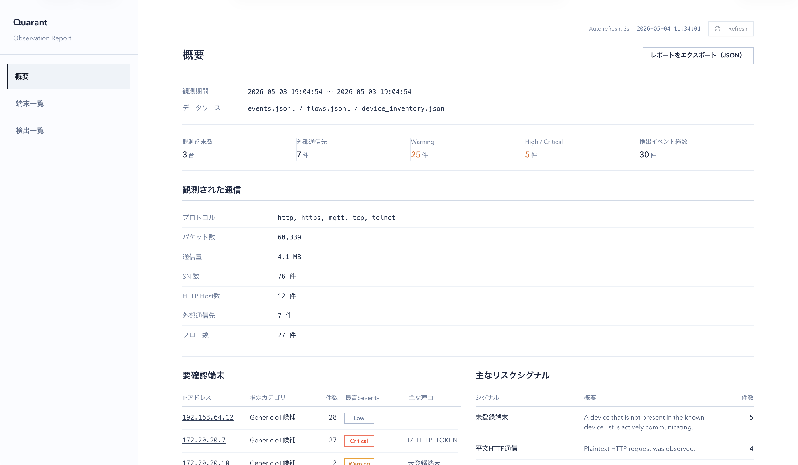

# Quarant

Quarant is a passive network observation tool for IoT devices running on Linux gateways, bridges, or routers.

It analyzes packets from a network interface or pcap file, reconstructs TCP flows, parses protocol metadata, and records network-visible risk signals mapped to the OWASP IoT Top 10.

Quarant does not log in to devices, attack them, brute-force credentials, actively scan networks, or decrypt HTTPS traffic. It focuses only on what can be observed from network traffic — recording each event as an observed fact, possible inference, limitation, and recommended next step.

This is a personal research project, not a production security tool.



## Why Quarant?

IoT devices often behave like black boxes. Users can see the device and the app, but usually cannot see where the device connects, what protocols it uses, or how updates and cloud communication work.

Quarant was built to make that hidden network behavior easier to inspect.

## What Quarant Observes

- Plaintext HTTP requests, headers, cookies, and body fragments
- Authorization headers and token-like values in URLs or bodies
- TLS ClientHello metadata — SNI, TLS version, cipher suites, JA3
- MQTT, Telnet, FTP, RTSP, and CoAP traffic
- Firmware-update-like paths and requests
- Device communication destinations and patterns
- Newly observed or unregistered devices

Each event is recorded with:

| Field | Meaning |
|---|---|
| `observed_fact` | What was actually observed |
| `inference` | What risk it may suggest |
| `limitation` | What cannot be confirmed passively |
| `recommendation` | What to check or do next |

Detected events are risk signals, not confirmed vulnerabilities.

## OWASP IoT Top 10 Mapping

Only network-visible signals are used. Not all categories can be fully diagnosed from traffic alone.

| Category | Network-visible signals |
|---|---|
| I1 Weak, Guessable, or Hardcoded Passwords | Credentials, tokens, and auth-like values in plaintext traffic |
| I2 Insecure Network Services | Telnet, MQTT, FTP, RTSP, CoAP, HTTP admin interfaces |
| I3 Insecure Ecosystem Interfaces | Plaintext API traffic, management endpoints, tokens in URLs |
| I4 Lack of Secure Update Mechanism | Firmware-update-like traffic and weak update visibility signals |
| I5 Use of Insecure or Outdated Components | Lightweight enrichment based on inferred device family and known issue candidates |
| I6 Insufficient Privacy Protection | Stable identifiers, history, backup, sync, and privacy-related endpoints |
| I7 Insecure Data Transfer and Storage | Plaintext HTTP, auth headers, cookies, tokens, MQTT/Telnet plaintext, TLS metadata risks |
| I8 Lack of Device Management | Newly observed devices, unregistered devices, inventory mismatch signals |


## Architecture

```text
packet capture / pcap input
        ↓
TCP flow reconstruction
        ↓
protocol parsers (HTTP / TLS / MQTT / Telnet)
        ↓
risk signal rules
        ↓
events.jsonl / flows.jsonl / device_inventory.json
        ↓
local report viewer
```

## Quick Start

### Requirements

- Linux
- Go 1.24 or later
- libpcap development package
- root or packet capture privileges
- Node.js and npm (for the web report viewer)

Ubuntu / Debian:

```bash
sudo apt update
sudo apt install -y git build-essential libpcap-dev
```

### Build

```bash
git clone https://github.com/SaeYoshizaki/Quarant.git
cd Quarant
go mod download
go build -o quarant ./cmd/quarant
```

### Build the Web Report Viewer

The report viewer is a static Next.js app served by Quarant's built-in server. Build it once before using `--report` or `--open`.

```bash
cd web
NEXT_PUBLIC_API_BASE_URL=http://127.0.0.1:8080 npm run build
cd ..
```

### Analyze a pcap File

```bash
./quarant analyze camera.pcap --out events.jsonl --report --open
```

`--report` starts the built-in report server. `--open` opens the report viewer in your browser automatically.

### Live Observation

```bash
sudo ./quarant live --iface eth0 --out events.jsonl --report --open
```

During live observation, `events.jsonl`, `flows.jsonl`, and `device_inventory.json` are updated in real time and the report viewer refreshes automatically.

## Example Findings

| Finding | Rule |
|---|---|
| Plaintext HTTP traffic | `I7_HTTP_PLAINTEXT` |
| Token in URL | `I3_AUTH_TOKEN_IN_URL`, `I7_HTTP_TOKEN` |
| Authorization header over HTTP | `I7_HTTP_AUTH` |
| Secret-like value in HTTP body | `I7_HTTP_BODY_SECRET` |
| Suspected HTTP admin interface | `I2_HTTP_ADMIN_INTERFACE_SUSPECTED` |
| Firmware-update-like request | `I4_FIRMWARE_UPDATE_OBSERVED` |
| Telnet traffic | `I2_TELNET_SERVICE_OBSERVED`, `I7_TELNET_PLAINTEXT` |
| Plaintext MQTT traffic | `I2_MQTT_SERVICE_OBSERVED`, `I7_MQTT_PLAINTEXT` |
| Weak TLS cipher offered | `I7_TLS_WEAK_CIPHER_OFFERED` |
| Newly observed device | `I8_NEW_DEVICE_OBSERVED` |

Example event:

```json
{
  "type": "INSECURE_HTTP_TOKEN",
  "severity": "CRITICAL",
  "rule_id": "I7_HTTP_TOKEN",
  "category": "I7",
  "owasp_tags": ["I1", "I3", "I7"],
  "confidence": "high",
  "observed_fact": "Sensitive token or identifier-like query parameter was observed over plaintext HTTP.",
  "inference": "Credentials, session tokens, or stable identifiers may be exposed in transit and in URL logs.",
  "limitation": "Passive monitoring cannot determine whether the value is still valid, whether it is hardcoded, or whether the API has additional protections.",
  "recommendation": "Avoid putting tokens in URLs, use HTTPS, and rotate exposed credentials or tokens if necessary."
}
```